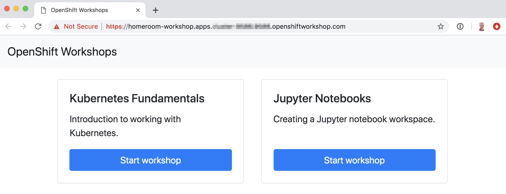

Workshop Home Room
==================

This repository contains software for deploying a web site providing an index of available workshops or labs.



Quick start instructions
------------------------

Create a file ``workshops.json``, which contains a list, in JSON format, of the workshops or labs available.

```
[
  {
    "title": "Kubernetes Fundamentals",
    "description": "Introduction to working with Kubernetes.",
    "url": "https://kube-lab-workshop.training.openshift.dev/"
  },
  {
    "title": "Jupyter Notebooks",
    "description": "Creating a Jupyter notebook workspace.",
    "url": "https://jupyter-lab-workshop.training.openshift.dev/"
  }
]
```

Then run:

```
oc new-app https://raw.githubusercontent.com/openshift-labs/workshop-homeroom/master/templates/production.json \
  --param WORKSHOPS_LIST="`cat workshops.json`"
```

If you don't have any workshops or labs to link to, you can leave off the ``WORKSHOPS_LIST`` parameter, in which case dummy test data will be used. You can then later edit the config map for the deployment and add entries for the workshops or labs.

By default the deployment will use the name ``homeroom``. You can override this using the ``APPLICATION_NAME`` template parameter.

To determine the hostname for the URL to access the application, run:

```
oc get route homeroom
```

Adding a backward link
----------------------

To have a user be returned back to the index when they have completed a workshop or lab, or they restart it, set the ``HOMEROOM_LINK`` environment variable on the workshop spawner deployment configuration for that workshop or lab.

```
oc set env dc/kube-lab HOMEROOM_LINK=https://homeroom-workshop.training.openshift.dev/
```

Note that availability of a button to end the workshop and return to the index will depend on the workshop content adding the required metadata on the final page. A user can also end the workshop and return to the index by using the "Restart Workshop" menu entry on the workshop environment dashboard.

Hiding entries in the list
--------------------------

To hide an entry in the list so it isn't displayed, without actually removing it from the configmap, you can add the ``visibility`` setting to the entry, with value "hidden".

```
[
  {
    "title": "Kubernetes Fundamentals",
    "description": "Introduction to working with Kubernetes.",
    "url": "https://kube-lab-workshop.training.openshift.dev/",
    "visibility": "hidden"
  },
  {
    "title": "Jupyter Notebooks",
    "description": "Creating a Jupyter notebook workspace.",
    "url": "https://jupyter-lab-workshop.training.openshift.dev/"
  }
]
```

If you edit an existing configmap to make this change, you will need to trigger a new deployment of the application to pick up the change.

```
oc rollout latest homeroom
```

Deleting the deployment
-----------------------

To delete the deployment, run:

```
oc delete all,configmap -l app=homeroom
```
